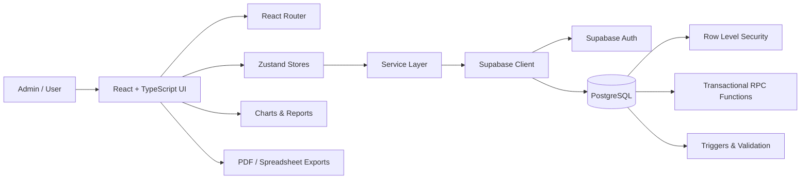

<div align="center">

# 🌸 Little Flowers Finance Tracker

### A full-stack financial operations platform built for real-world school administration.

**Student fees · Income · Expenses · Transfers · Recoverables · Reporting · Academic Years**

<br />

[](https://react.dev/)
[](https://www.typescriptlang.org/)
[](https://vitejs.dev/)
[](https://supabase.com/)
[](https://tailwindcss.com/)
[](https://vitest.dev/)
[](https://playwright.dev/)

<br />

**Designed around a simple principle: financial data should be understandable, traceable, and difficult to accidentally corrupt.**

</div>

---

## 📖 About

**Little Flowers Finance Tracker** is a purpose-built web application for managing the day-to-day financial operations of a school.

It brings student fees, previous-year dues, income, expenses, transfers, recoverable advances, account balances, academic-year records, and financial reporting into a single system.

Rather than functioning as a basic income-and-expense tracker, the application models real administrative workflows such as:

* current and historical student fee collection,
* academic-year progression,
* previous-year pending fees,
* account-to-account money movement,
* recurring operational expenses,
* recoverable advances and repayments,
* bilingual administration,
* financial reconciliation,
* and school-specific reporting.

The application is built with a **React + TypeScript frontend** and a **Supabase/PostgreSQL backend**, with authentication, Row Level Security, database validation, transactional workflows, and automated testing.

---

## ✨ Features

### 💰 Financial Management

* **Financial dashboard** — view fee collection, available liquidity, recent activity, income, expenses, and important pending items at a glance.
* **Income tracking** — manage tuition fees, previous-year fee collections, lunch fees, and other school income.
* **Expense tracking** — record and categorize school and personal/home expenses separately.
* **Account management** — maintain school bank, personal bank, cash, and other financial accounts.
* **Transfers** — record deposits, withdrawals, and account-to-account money movement without incorrectly affecting profit.
* **Live account balances** — balances are derived from the complete financial transaction history.
* **Recurring expenses** — create recurring templates with a review workflow before transactions are posted.
* **Recoverables** — track money temporarily advanced to staff or others and record partial or complete repayments.

### 🎓 Student & Fee Management

* Organize students by **class, medium, and academic year**.
* Separate **Gujarati Medium** and **English Medium** workflows.
* Maintain student-level annual fee obligations.
* Track **paid, partial, and pending fees**.
* Record current-year payments.
* Preserve previous-year dues and historical payment context.
* View complete student payment history.
* Track payment methods such as cash, UPI, bank transfer, cheque, and others.
* Archive students without destroying historical financial information.
* Calculate class-wise and medium-wise fee summaries automatically.

### 📥 Intelligent Student Import

Bulk student import is designed for real administrative spreadsheets rather than requiring one rigid file format.

The import workflow supports:

* Excel/CSV-style spreadsheet data,
* flexible column mapping,
* student and class detection,
* medium identification,
* annual-fee values,
* collected-fee values,
* previous-year pending fees,
* opening financial history,
* duplicate/conflict detection,
* malformed amount validation,
* default values where appropriate,
* and validation before data is committed.

### 📊 Reporting & Insights

* Monthly financial trends
* Income vs. expense analysis
* Expense-category breakdowns
* Academic-year Profit & Loss reporting
* Year-over-year comparisons
* Current and historical student-fee reporting
* Class-wise fee summaries
* Medium-wise fee summaries
* Pending-fee reports
* Financial transaction history
* PDF exports
* CSV / spreadsheet exports

### 🌍 Bilingual Interface

The application supports:

* 🇬🇧 **English**
* 🇮🇳 **Gujarati — ગુજરાતી**

The selected language can be switched at runtime and is persisted for future sessions.

---

## 🧠 Engineering Highlights

This project goes beyond interface development and includes several non-trivial software-engineering decisions.

| Area                      | Implementation                                                                                |
| ------------------------- | --------------------------------------------------------------------------------------------- |
| **Frontend Architecture** | React + TypeScript with separated pages, components, stores, services, and domain utilities   |
| **State Management**      | Zustand                                                                                       |
| **Validation**            | Zod + React Hook Form                                                                         |
| **Backend**               | Supabase + PostgreSQL                                                                         |
| **Authentication**        | Supabase Auth                                                                                 |
| **Authorization**         | PostgreSQL Row Level Security                                                                 |
| **Database Logic**        | SQL migrations, validation functions, triggers, and RPC workflows                             |
| **Financial Integrity**   | Domain-aware handling of transfers, balances, recoverables, fees, and historical transactions |
| **Testing**               | Vitest, Testing Library, SQL/database checks, and Playwright                                  |
| **Localization**          | Shared English/Gujarati translation system                                                    |
| **Exports**               | PDF and spreadsheet-based reporting                                                           |
| **Deployment**            | Vite SPA with Vercel configuration                                                            |

---

## 🧱 Architecture



### Application flow

```text
Pages / Components
        │
        ▼
   Zustand Stores
        │
        ▼
    Services
        │
        ▼
 Supabase Client
        │
        ▼
PostgreSQL Database
        │
        ├── Row Level Security
        ├── Validation
        ├── Triggers
        └── Transactional RPCs
```

Keeping these responsibilities separate makes the application easier to reason about, test, and maintain while preventing important financial rules from existing only inside UI components.

---

## 🗃️ Core Data Model

The application models financial and academic data as connected domains rather than storing everything in one general transaction table.

| Domain                 | Main Records             |
| ---------------------- | ------------------------ |
| Academic configuration | `academic_years`         |
| Financial accounts     | `accounts`               |
| Income                 | `income_entries`         |
| Expenses               | `expense_entries`        |
| Transfers              | `transfers`              |
| Recurring transactions | `recurring_templates`    |
| Students               | `students`               |
| Academic enrollment    | `student_enrollments`    |
| Recoverable advances   | `recoverables`           |
| Recoverable repayments | `recoverable_repayments` |

### Why separate students and enrollments?

A student's identity remains stable while their:

* class,
* medium,
* academic year,
* annual fee,
* opening balances,
* and enrollment status

can change over time.

Separating **student identity** from **academic-year enrollment** preserves historical information without duplicating the student.

---

## 🧮 Financial Domain Rules

Some of the most important logic in the application comes from modeling financial events correctly.

### 🔁 Transfers are not income or expenses

Moving ₹10,000 from a bank account to cash changes where the money is stored.

It does **not** generate ₹10,000 of new income or ₹10,000 of additional expense.

Transfers therefore affect account liquidity without affecting operating profit.

### 🤝 Recoverables are handled separately

Money temporarily advanced to another person is tracked independently from ordinary operational expenses.

When that money is repaid:

* account liquidity is restored,
* the outstanding recoverable decreases,
* but the repayment is **not counted as new income**.

### 🎓 Historical fees preserve academic context

A payment received today for a previous academic year's pending fee must retain both:

* the academic year the obligation belongs to, and
* the actual date the cash was received.

This keeps historical fee reporting accurate without distorting present-day cash flow.

### 💳 Account balances come from transaction history

Balances are derived from:

```text
Opening Balance
+ Income
+ Incoming Transfers
+ Recoverable Repayments
- Expenses
- Outgoing Transfers
- Recoverable Advances
```

This avoids maintaining unrelated balance values that can silently drift away from the actual financial ledger.

---

## 🔐 Security & Data Integrity

Financial applications depend on correctness as much as interface design.

The project therefore includes safeguards at both the frontend and database layers.

* 🔐 Supabase authentication
* 🛡️ PostgreSQL **Row Level Security**
* 👤 User-owned workspace isolation
* ✅ Financial-entry validation
* ✅ Student-enrollment validation
* ✅ Academic-year validation
* ✅ Transfer ownership checks
* ✅ Prevention of invalid/self transfers
* ✅ Recoverable-balance validation
* ✅ Historical student-fee consistency checks
* ⚙️ Transactional database workflows for multi-step operations
* 💾 Controlled backup and restore
* 🧪 Local integration safety checks

Critical financial constraints are not enforced exclusively by frontend validation.

Important rules are also represented at the **database level**, reducing the risk of inconsistent data.

---

## 🛠️ Tech Stack

| Layer                        | Technology                        |
| ---------------------------- | --------------------------------- |
| **Frontend**                 | React 18, TypeScript, Vite        |
| **Styling / UI**             | Tailwind CSS, shadcn/ui, Radix UI |
| **Icons / Motion**           | Lucide React, Framer Motion       |
| **Routing**                  | React Router                      |
| **State Management**         | Zustand                           |
| **Forms**                    | React Hook Form                   |
| **Validation**               | Zod                               |
| **Backend**                  | Supabase                          |
| **Database**                 | PostgreSQL                        |
| **Authentication**           | Supabase Auth                     |
| **Security**                 | PostgreSQL Row Level Security     |
| **Charts**                   | Recharts                          |
| **Spreadsheet Processing**   | `@e965/xlsx`                      |
| **PDF Generation**           | jsPDF + jsPDF AutoTable           |
| **Unit / Component Testing** | Vitest + Testing Library          |
| **End-to-End Testing**       | Playwright                        |
| **Deployment Configuration** | Vercel                            |

---

## 📂 Project Structure

```text
.
├── e2e/
│   └── Playwright end-to-end tests
│
├── public/
│   └── Static assets and web manifest
│
├── scripts/
│   └── Local database / release safety checks
│
├── src/
│   ├── components/
│   │   ├── dashboard/
│   │   ├── students/
│   │   └── ui/
│   │
│   ├── hooks/
│   ├── integrations/
│   │   └── supabase/
│   │
│   ├── lib/
│   ├── pages/
│   ├── services/
│   ├── store/
│   ├── test/
│   ├── types/
│   └── utils/
│
├── supabase/
│   ├── migrations/
│   ├── preflight/
│   └── tests/
│
├── package.json
├── vite.config.ts
└── vitest.config.ts
```

### Directory responsibilities

* **`components/`** — reusable interface and feature components
* **`pages/`** — application-level routes
* **`store/`** — Zustand application state
* **`services/`** — Supabase-backed data access
* **`lib/`** — domain logic, localization, imports, backups, and shared utilities
* **`types/`** — shared TypeScript domain models
* **`supabase/migrations/`** — database schema, RLS policies, functions, and integrity changes
* **`supabase/tests/`** — database-level integrity checks
* **`e2e/`** — authenticated Playwright workflows

---

## 🚀 Getting Started

### Prerequisites

You will need:

* **Node.js 18+**
* **npm**
* A **Supabase project**
* Supabase CLI if you want to apply migrations or run the local database workflow from the command line

### 1. Clone the repository

```bash
git clone <your-repository-url>
cd lf-finance-management-software
```

### 2. Install dependencies

```bash
npm install
```

### 3. Configure environment variables

Create a `.env` file in the project root.

```env
VITE_SUPABASE_URL=your_supabase_project_url
VITE_SUPABASE_PUBLISHABLE_KEY=your_supabase_publishable_key
```

> [!IMPORTANT]
> Never commit service-role keys, passwords, or other privileged credentials to the repository.

### 4. Apply database migrations

Database schema changes, Row Level Security policies, functions, and integrity rules are versioned inside:

```text
supabase/migrations/
```

With the Supabase CLI:

```bash
supabase link --project-ref <your-project-ref>
supabase db push
```

### 5. Start development

```bash
npm run dev
```

Vite will display the local development URL in the terminal.

---

## 🎮 Demo Workspace

The application includes an **Explore Demo** workflow backed by anonymous Supabase authentication.

Demo mode can:

* create an isolated workspace,
* populate realistic sample data,
* allow normal application exploration,
* reset demo information,
* and remove the demo workspace when finished.

To enable it:

1. Enable anonymous authentication in Supabase.
2. Apply the included database migrations.
3. Start the application.
4. Select **Explore Demo** from the authentication screen.

Demo data remains isolated from normal registered-user workspaces.

---

## 🧪 Testing & Quality

The repository contains automated testing across multiple layers.

### Unit & Component Tests

Powered by:

* **Vitest**
* **Testing Library**

Coverage includes areas such as:

* fee calculations,
* financial-domain calculations,
* account balances,
* student ordering,
* academic class progression,
* import validation,
* backup parsing,
* bilingual UI behavior,
* and dashboard calculations.

### End-to-End Tests

**Playwright** tests authenticated application workflows against a local Supabase environment.

Areas covered include:

* authentication,
* application setup,
* current-year payments,
* previous-year fee workflows,
* transaction behavior,
* student workflows,
* and finance journeys.

### Database Integrity

The repository also contains SQL/database-oriented checks for important financial assumptions and data relationships.

---

## ✅ Quality Commands

```bash
# Start development
npm run dev

# TypeScript validation
npm run typecheck

# Run ESLint
npm run lint

# Unit / component tests
npm run test

# Production build
npm run build

# End-to-end tests
npm run test:e2e
```

### Local Database Safety Gate

Before destructive integration-style finance checks are executed, the project verifies that the configured Supabase instance is local.

The safety gate accepts loopback hosts such as:

```text
localhost
127.0.0.1
```

This helps prevent development tests from accidentally running against a remote production database.

---

## 💾 Backup & Restore

The application includes a controlled backup and restoration workflow for core financial information.

Backup functionality is separated from ordinary reports and exports so that:

* reports remain human-readable outputs,
* backups preserve application data,
* and restoration can follow a validated workflow.

---

## 🌍 Localization

English and Gujarati use a shared localization layer rather than separate duplicated interfaces.

```text
English 🇬🇧
Gujarati 🇮🇳 ગુજરાતી
```

The active language can be changed from the application and persisted for future sessions.

This keeps finance terminology and administrative workflows consistent across both languages while maintaining one application codebase.

---

## 📱 Responsive Experience

The interface is designed for administrative use across different screen sizes.

The application supports:

* desktop finance workflows,
* tablet-sized administration,
* smaller-screen access,
* responsive dashboards,
* student management,
* forms,
* and reporting interfaces.

---

## ☁️ Deployment

The project includes configuration for deployment as a Vite single-page application.

For a production deployment:

1. Build the project.

```bash
npm run build
```

2. Configure the required Supabase environment variables on the hosting platform.

3. Ensure SPA routing is configured correctly.

The repository includes configuration suitable for deployment through **Vercel**.

---

## 🎯 Engineering Focus

The project was developed around several core software-engineering goals:

**01 — Model the real problem**

Translate actual administrative and financial workflows into explicit software concepts instead of forcing everything into generic CRUD screens.

**02 — Protect financial correctness**

Treat balances, transfers, fees, historical dues, and recoverables as connected financial concepts with defined rules.

**03 — Separate responsibilities**

Keep UI components, application state, services, domain logic, and database operations separate.

**04 — Preserve history**

Maintain academic-year and transaction context rather than overwriting old information as students progress.

**05 — Design for real users**

Keep workflows understandable for non-technical administrative staff who need to perform repetitive tasks efficiently.

**06 — Validate at multiple layers**

Use frontend validation for usability while maintaining critical integrity guarantees at the database level.

**07 — Keep important logic testable**

Move financial and academic rules into reusable logic that can be exercised independently of the interface.

---

## 🚧 Current Status

The project is under active development.

The repository currently includes the core workflows for:

* student management,
* academic-year enrollment,
* fee collection,
* historical dues,
* income,
* expenses,
* financial accounts,
* transfers,
* recoverables,
* reporting,
* bilingual administration,
* backup and restore,
* demo workspaces,
* database integrity,
* and automated testing.

Ongoing work focuses on improving usability, reliability, maintainability, and administrative efficiency.

---

## 🔒 License

This project was developed for **Little Flowers School** and is maintained as a private/internal application.

**All rights reserved.**

The source code is not licensed for external redistribution or commercial reuse without permission.

---

<div align="center">

### 🌸 Little Flowers Finance Tracker

**Built to turn complex school-finance workflows into clear, reliable software.**

<br />

`React` · `TypeScript` · `Supabase` · `PostgreSQL` · `Tailwind CSS`

<br />

🏫 **Little Flowers School**

</div>
